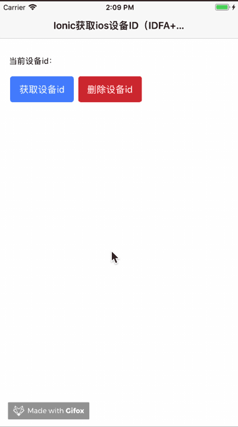

# 项目说明

此项目是[cordovan-plugin-keychain-idfa](https://github.com/jasonz1987/cordova-plugin-keychain-idfa.git)插件的demo工程。


# 使用方法

```
git clone https://github.com/jasonz1987/ionic-keychain-idfa-demo.git
```
```
cd ionic-keychain-idfa-demo
```
```
npm install
```
```
ionic cordova platform add ios
```
```
ionic cordova plugin add cordova-plugin-keychain-idfa
```
```
ionic cordova build ios
```


# 演示效果




*可尝试更话卸载重新安装，或者更换包名来验证设备id是否一致*


# 赞赏

如果我的插件帮助到了你，欢迎赞赏。


